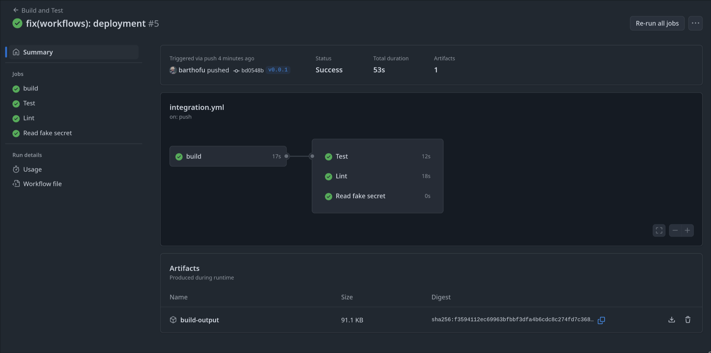
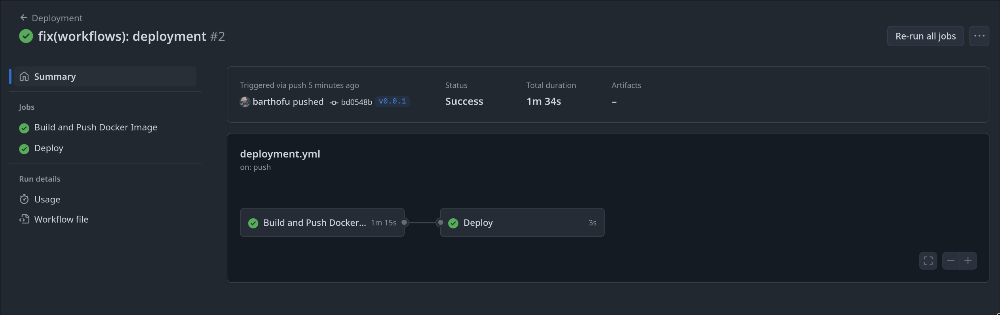
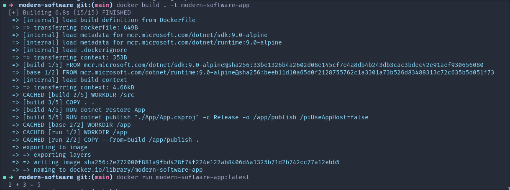

# ModernSoftwareApp

ModernSoftwareApp is a .NET 8.0 console application developed as part of a lab focused on automating the Software Development Life Cycle (SDLC) using GitHub Actions, Docker, and code quality tools.

This project demonstrates modern DevOps practices within a real-world software development cycle: automated builds, tests, code quality analysis, continuous delivery, and secure configuration management.

## Answers to the practical exercise

> In french

1. Capture d’écran de l’exécution des pipelines:
   
   

2. Capture d’écran de l’image Docker exécutée:
    

3. Explication courte : “Quel est le rôle du CI/CD et des tests dans un projet réel?”

> Le CI/CD (Intégration et Déploiement Continus) automatise les étapes de compilation, tests, analyse de qualité, et déploiement du code à chaque modification. Cela permet de détecter rapidement les erreurs, garantir la stabilité de l'application et accélérer la mise en production.
> Les tests automatisés, eux, valident que le comportement du code reste correct malgré les changements. Ils réduisent les bugs, facilitent la maintenance et inspirent confiance aux développeurs comme aux utilisateurs.
> Mis ensembles, CI/CD et tests assurent une livraison rapide, fiable et de qualité du logiciel, collant parfaitement aux méthodologies Agile et DevOps.

## Features

- Simple C# console app with a `Calculator` class
- Unit tests using xUnit
- CI/CD pipeline with GitHub Actions
- Static code analysis with `dotnet format`
- Multi-stage Docker image
- Simulated deployment
- GitHub Secrets integration

## Prerequisites

- GitHub account
- .NET SDK 9.0
- Docker
- Git

Or if you're using [Nix](https://nixos.org/download.html), you can use the provided `flake.nix` file to set up a development environment with all dependencies:
```bash
make shell
```

### GitHub Secrets

Add a secret named `MY_SECRET` in the GitHub repository settings (Settings > Secrets > Actions).

## Usage

```
dotnet run --project App

dotnet test Tests

dotnet build App --configuration Release
```

## License

This project is provided for educational purposes. No explicit license is applied.